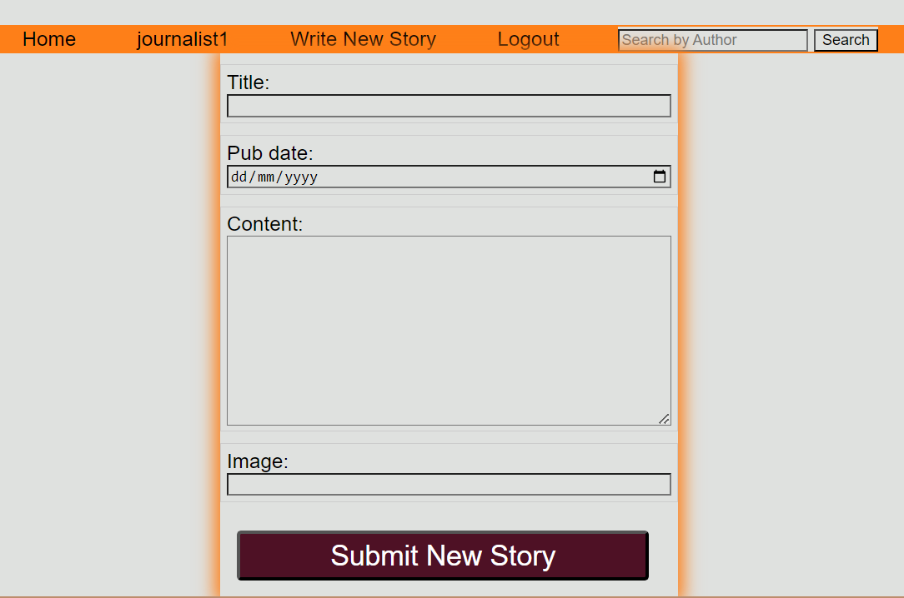

# Lanie Ruiz-Perez - She Codes News Project
## About This Project
This repo contains code which was personalised from the SheCodes original template for the django module. This is the state as submitted for the assignment of the django module of the SheCodes Plus Perth cohort in Dec 2023.
The project is a website which allows users to visit a news stories site, create their accounts and log in, submit news stories for other users to see, and view stories by other authors. All of this taking into account the appropiate permissions for logged in users, and making use of predefined django models. 
To achieve this, there are two apps (news and users) which can be found within the folder structure of the repo, following common practice.
A fixtures file is also available in news/fixtures.
## How To Run This Code
As this is a public repo, if you are reading this and are interested in trying it for yourself these are some steps you can follow:
- Clone the repo and open in your local terminal
- Create a virtual environment and install the requirements
- Load the fixtures so you don't land in an empty site
- Navigate to the location of manage.py and run the server
- Follow the link provided which should open your web browser
- Edit the IP address to access the news site by adding `/news` at the end. This should show the news website with some news content and style
- Create an account: To do this add `/users/createaccount` at the end of the original IP address. Fill and submit the form
- Log in: this way you'll be able to access the rest of the functionality of the site as described below

## Database Schema

## Project Features
- [X] Order stories by date

- [X] Styled "new story" form

- [x] Story images

- [ ] Log-in/log-out

- [ ] "Account view" page

- [ ] "Create Account" page

- [ ] View stories by author

- [ ] "Log-in" button only visible when no user is logged in/"Log-out" buttononly visible when a user *is* logged in

- [ ] "Create Story" functionality only available when user is logged in

## Additional Features:
- [ ] Add categories to the stories and allow the user to search for stories bycategory.

- [ ] Add the ability to update and delete stories (consider permissions - whoshould be allowed to update or and/or delete stories).

- [ ] Add the ability to “favourite” stories and see a page with your favouritestories.

- [ ] Our form for creating stories requires you to add the publication date,update this to automatically save the publication date as the day thestory was first published (maybe you could then add a field to showwhen the story was updated).

- [ ] Gracefully handle the error where someone tries to create a new story whenthey are not logged in.